---
## Front matter
title: "Отчёт по лабораторной работе №2"
subtitle: "Архитектура вычислительных систем"
author: "Сабралиева Марворид Нуралиевна"

## Generic otions
lang: ru-RU
toc-title: "Содержание"

## Bibliography
bibliography: bib/cite.bib
csl: pandoc/csl/gost-r-7-0-5-2008-numeric.csl

## Pdf output format
toc: true # Table of contents
toc-depth: 2
lof: true # List of figures
lot: true # List of tables
fontsize: 12pt
linestretch: 1.5
papersize: a4
documentclass: scrreprt
## I18n polyglossia
polyglossia-lang:
  name: russian
  options:
	- spelling=modern
	- babelshorthands=true
polyglossia-otherlangs:
  name: english
## I18n babel
babel-lang: russian
babel-otherlangs: english
## Fonts
mainfont: PT Serif
romanfont: PT Serif
sansfont: PT Sans
monofont: PT Mono
mainfontoptions: Ligatures=TeX
romanfontoptions: Ligatures=TeX
sansfontoptions: Ligatures=TeX,Scale=MatchLowercase
monofontoptions: Scale=MatchLowercase,Scale=0.9
## Biblatex
biblatex: true
biblio-style: "gost-numeric"
biblatexoptions:
  - parentracker=true
  - backend=biber
  - hyperref=auto
  - language=auto
  - autolang=other*
  - citestyle=gost-numeric
## Pandoc-crossref LaTeX customization
figureTitle: "Рис."
tableTitle: "Таблица"
listingTitle: "Листинг"
lofTitle: "Список иллюстраций"
lotTitle: "Список таблиц"
lolTitle: "Листинги"
## Misc options
indent: true
header-includes:
  - \usepackage{indentfirst}
  - \usepackage{float} # keep figures where there are in the text
  - \floatplacement{figure}{H} # keep figures where there are in the text
---

# Цель работы

Изучить идеологию и применение средств контроля версий.
Приобрести практические навыки по работе с системой git.

# Задание

1. Создайте отчет по выполнению лабораторной работы в соответствующем
каталоге рабочего пространства (labs>lab03>report).
2. Скопируйте отчеты по выполнению предыдущих лабораторных работ в
соответствующие каталоги созданного рабочего пространства.
3. Загрузите файлы на github.
# Теоретическое введение

1. Cистемы контроля версий. Общие понятия
Системы контроля версий (Version Control System, VCS) применяются при работе нескольких человек над одним проектом. Обычно основное дерево про- екта хранится в локальном или удалённом репозитории, к которому настроен доступ для участников проекта. При внесении изменений в содержание проекта система контроля версий позволяет их фиксировать, совмещать изменения,
произведённые разными участниками проекта, производить откат к любой более ранней версии проекта, если это требуется. В классических системах контроля версий используется централизованная модель, предполагающая наличие единого репозитория для хранения файлов. Выполнение большинства функций по управлению версиями осуществляется специальным сервером. Участник проекта (пользователь) перед началом работы посредством определённых команд получает нужную ему версию файлов. После внесения изменений, пользователь размещает новую версию в хранилище. При этом предыдущие версии не удаляются из центрального хранилища и к ним можно вернуться в любой момент. Сервер может сохранять не полную версию
изменённых файлов, а производить так называемую дельта-компрессию — сохранять только изменения между последовательными версиями, что позволяет уменьшить объём хранимых данных.Системы контроля версий поддерживают возможность отслеживания и разрешения конфликтов, которые могут возникнуть при работе нескольких человек над одним файлом. Можно объединить (слить) изменения, сделанные разными участниками (автоматически или вручную), вручную выбрать нужную версию, отменить изменения вовсе или заблокировать файлы для изменения. В зависbмости от настроек блокировка не позволяет другим пользователям получить рабочую копию или препятствует изменению рабочей копии файла средствами файловой системы ОС, обеспечивая таким образом, привилегированный доступ только одному пользователю, работающему с файлом. Системы контроля версий также могут обеспечивать дополнительные, более гибкие функциональные возможности. Например, они могут поддерживать работу с несколькими версиями одного файла, сохраняя общую историю изменений до точки ветвления версий и собственные истории изменений каждой ветви. Кроме того, обычно доступна информация о том, кто из участников, когда и какие изменения вносил. Обычно такого рода информация хранится в журнале изменений, доступ к которому можно ограничить.
В отличие от классических, в распределённых системах контроля версий центральный репозиторий не является обязательным. Среди классических VCS наиболее известны CVS, Subversion, а среди распределённых — Git, Bazaar, Mercurial. Принципы их работы схожи, отличаются они в основном синтаксисом используемых в работе команд.
2. Основные команды git
Наиболее часто используемые команды git представлены в таблице 2.1.
Таблица 2.1. Основные команды git
Команда            Описание
git init           создание основного дерева репозитория
git pull           получение обновлений (изменений) текущего дерева из центрального репозитория
git push      отправка всех произведённых изменений локального дерева в центральный репозиторий
git status         просмотр списка изменённых файлов в текущей директории
git diff          просмотр текущих изменения
git add .           добавить все изменённые и/или созданные файлы и/или каталоги
git add              файлы и/или каталоги
git rm              имена_файлов удалить файл и/или каталог из индекса репозитория (при этом файл и/или каталог остаётся в локальной директории)
git commit -am      'Описание коммита' сохранить все добавленные изменения и все изменённые файлы
git checkout -b      имя_ветки создание новой ветки, базирующейся на
текущей
git checkout         имя_ветки переключение на некоторую ветку (при переключении  на ветку, которой ещё нет в локальном репозитории, она будет создана и связана с удалённой)
git push origin        имя_ветки отправка изменений конкретной ветки в wентральный репозиторий
git merge --no-ff       имя_ветки слияние ветки с текущим деревом
git branch -d            имя_ветки удаление локальной уже слитой с основным деревом ветки
git branch -D          имя_ветки принудительное удаление локальной ветки
git push origin        :имя_ветки удаление ветки с центрального репозитория

# Выполнение лабораторной работы

1. Создадим учётную запись на сайте https://github.com/ и заполним
основные данные как видно на рисунке [-@fig:001]

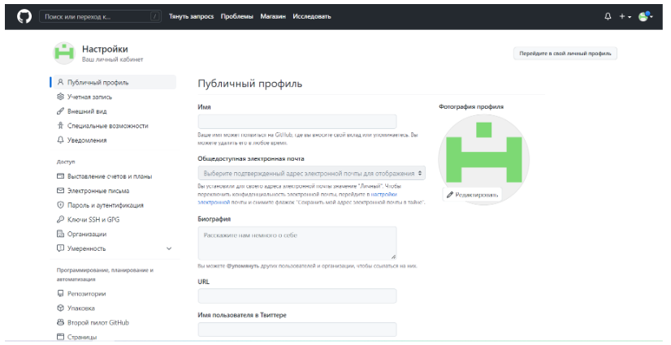{ #fig:001 width=90% }

2. Сначала сделаем предварительную конфигурацию «git». Для
этого нужно открыть терминал и ввести команды «git config –global», указав
имя и email владельца репозитория:рис [-@fig:002]

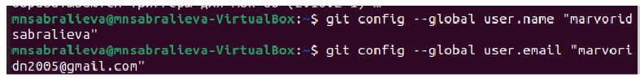{ #fig:002 width=90% }

Настроим utf-8 в выводе сообщений “git”:[-@fig:003]

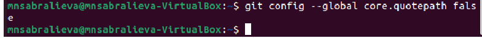{ #fig:003 width=90% }

Зададим имя начальной ветки (будем называть её master):[-@fig:004]

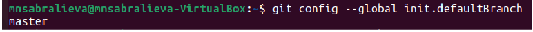{ #fig:004 width=90% }

Введём параметр “autocrlf” и параметр “safecrlf”:[-@fig:005]

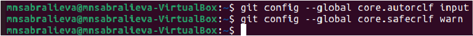{ #fig:005 width=90% }

3. Для последующей идентификации пользователя на сервере
репозиториев сгенерируем пару ключей (приватный и открытый):[-@fig:006]

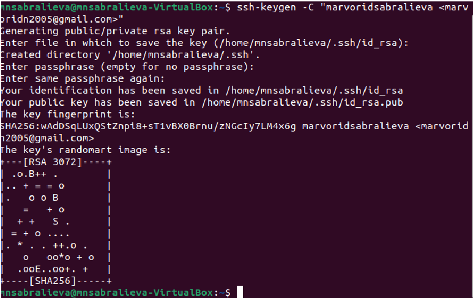{ #fig:006 width=90% }

Далее необходимо загрузить сгенерённый открытый ключ на сайт
http://github.org Для этого копируем из локальной консоли ключ в буфер обмена:[-@fig:007]

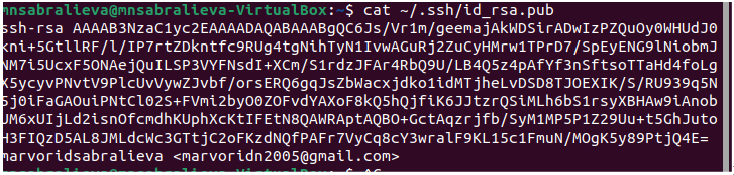{ #fig:007 width=90% }

Вставляем ключ в появившееся на сайте поле и указываем для ключа имя (Title).[-@fig:008]

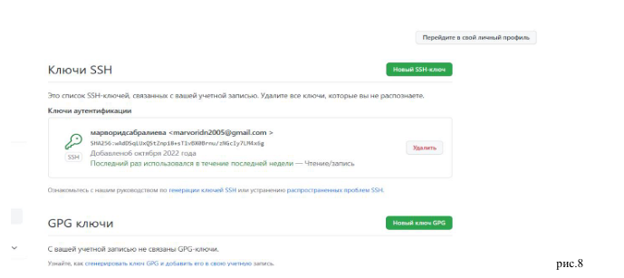{ #fig:008 width=90% }

4. Откройте терминал и создайте каталог для предмета «Архитектура компьютера»:[-@fig:009]

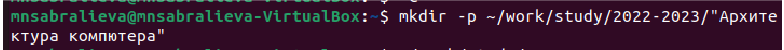{ #fig:009 width=90% }

Проверим созданные каталоги:[-@fig:010]

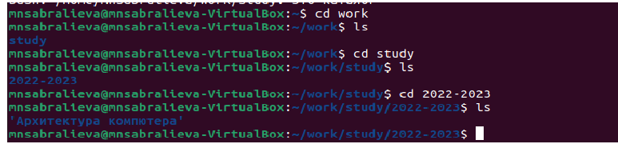{ #fig:010 width=90% }

5. Создадим репозиторий на основе шаблона через web-интерфейс
github. Для этого перейдём на станицу репозитория с шаблоном курса
https://github.com/yam adharma/course-directory-student-template. Далее
выберем «Use this template». В открывшемся окне зададим имя репозитория
(Repository name) study_2022–2023_arh-pc и создадим репозиторий:[-@fig:011]

{ #fig:0011 width=90% }

Откроем терминал и перейдём в каталог курса: « work/study/2022-
2023/"Архитектура компьютера"» и клонируем созданный репозиторий с
помощью команды “git clone”:[-@fig:012]

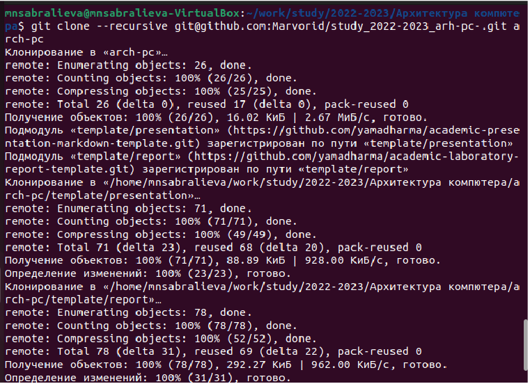{ #fig:012 width=90% }

6. Перейдём в каталог курса и удалим лишние файлы с помощью
команды “ rm” [-@fig:013]

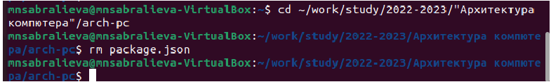{ #fig:013 width=90% }

Создадим необходимые каталоги(рис.14) и отправим файлы на сервер (рис.15
и рис.16)[-@fig:14] [-@fig:015]   [-@fig:016]

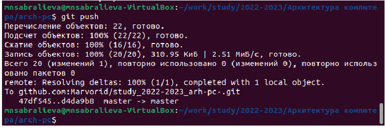{ #fig:016 width=90% }

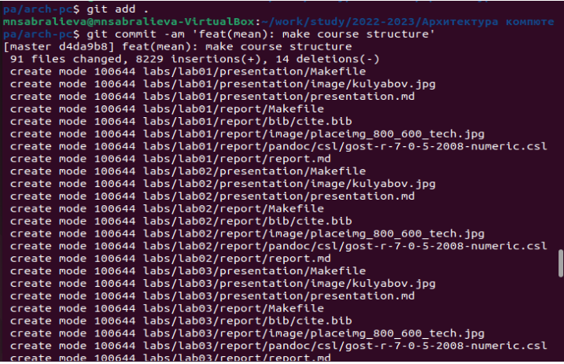{ #fig:015 width=90% }

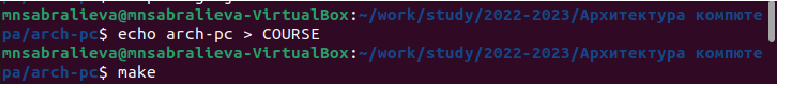{ #fig:014 width=90% }
Проверим правильность создания иерархии рабочего пространства в
локальном репозитории (рис.17) и на странице github ( рис.18):[-@fig:017]

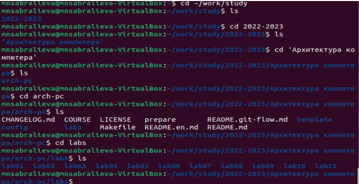{ #fig:017 width=90% }

[-@fig:018]

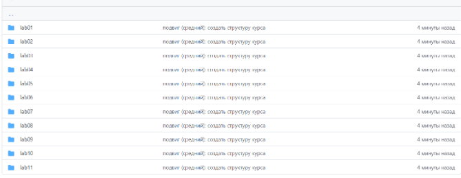{ #fig:018 width=90% }
5. Скопируем отчеты по выполнению предыдущей лабораторной
работы(рис.19) и текущей(рис.20) в соответствующие каталоги созданного
рабочего пространства и загрузим их на сайт github:[-@fig:019]   [-@fig:020]

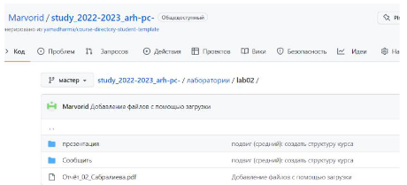{ #fig:020 width=90% }

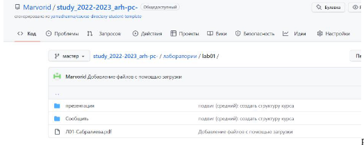{ #fig:019 width=90% }

# Выводы

 в ходе выполнения данной лабораторной работы я изучила идеологию и применение средств контроля версий, и также приобрела практические навыки по работе с системой git.

