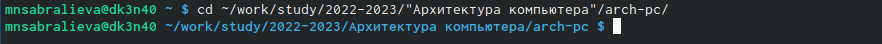
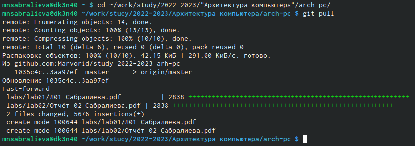
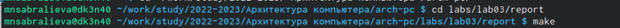
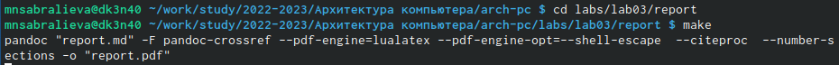
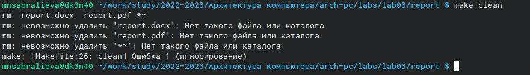
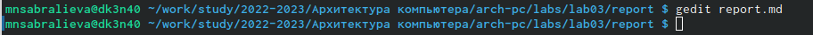
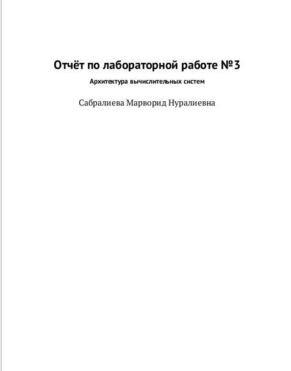
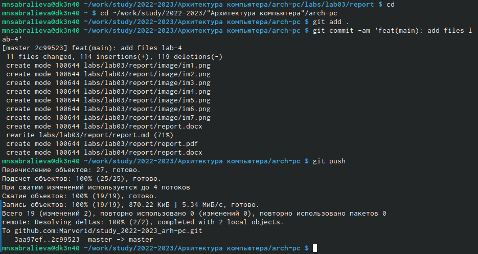
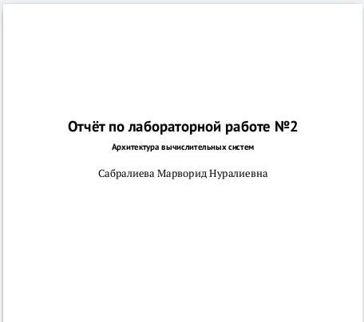

---
## Front matter
title: "Отчёт по лабораторной работе №3"
subtitle: "Архитектура вычислительных систем"
author: "Сабралиева Марворид Нуралиевна"

## Generic otions
lang: ru-RU
toc-title: "Содержание"

## Bibliography
bibliography: bib/cite.bib
csl: pandoc/csl/gost-r-7-0-5-2008-numeric.csl

## Pdf output format
toc: true # Table of contents
toc-depth: 2
lof: true # List of figures
lot: true # List of tables
fontsize: 12pt
linestretch: 1.5
papersize: a4
documentclass: scrreprt
## I18n polyglossia
polyglossia-lang:
  name: russian
  options:
	- spelling=modern
	- babelshorthands=true
polyglossia-otherlangs:
  name: english
## I18n babel
babel-lang: russian
babel-otherlangs: english
## Fonts
mainfont: PT Serif
romanfont: PT Serif
sansfont: PT Sans
monofont: PT Mono
mainfontoptions: Ligatures=TeX
romanfontoptions: Ligatures=TeX
sansfontoptions: Ligatures=TeX,Scale=MatchLowercase
monofontoptions: Scale=MatchLowercase,Scale=0.9
## Biblatex
biblatex: true
biblio-style: "gost-numeric"
biblatexoptions:
  - parentracker=true
  - backend=biber
  - hyperref=auto
  - language=auto
  - autolang=other*
  - citestyle=gost-numeric
## Pandoc-crossref LaTeX customization
figureTitle: "Рис."
tableTitle: "Таблица"
listingTitle: "Листинг"
lofTitle: "Список иллюстраций"
lotTitle: "Список таблиц"
lolTitle: "Листинги"
## Misc options
indent: true
header-includes:
  - \usepackage{indentfirst}
  - \usepackage{float} # keep figures where there are in the text
  - \floatplacement{figure}{H} # keep figures where there are in the text
---

# Цель работы

Целью работы является освоение процедуры оформления отчетов с помощью
легковесного языка разметки Markdown.
# Задание

1. В соответствующем каталоге сделайте отчёт по лабораторной работе No 3
в формате Markdown. В качестве отчёта необходимо предоставить отчёты
в 3 форматах: pdf, docx и md.
2. Загрузите файлы на github.

# Выполнение лабораторной работы
1. Откроем терминал как на рисунке [-@fig:001]

{ #fig:001 width=90% }

2. Перейдём в каталог курса сформированный при выполнении лабораторной работы №2и обновим локальный репозиторий, скачав изменения из удаленного репозитория с помощью команды "git pul" как на рисунке [-@fig:002]

{ #fig:002 width=90% }

3. Перейдём в каталог с шаблоном отчета по лабораторной работе №3 рисунок [-@fig:003]

{ #fig:003 width=90% }

4. Проведём компиляцию шаблона с использованием Makefile. Для этого введём команду "make" как на рисунке [-@fig:004]

{ #fig:004 width=90% }

5. Удалим полученные файлы с использованием Makefile. Для этого введём команду "make clean" как на рисунке [-@fig:005]

{ #fig:005 width=90% }

6. Откроем файл report.md c помощью любого текстового редактора,в моём случае это gedit как на рисунке [-@fig:006]

{ #fig:006 width=90% }

7. Заполним отчет и скомпилируем отчет с использованием Makefile.Проверим корректность полученных данных на рисунке [-@fig:007]

{ #fig:007 width=90% }

8. Загрузим файлы на Github как показано на рисунке [-@fig:008]

{ #fig:008 width=90% }

9. Задание для самостоятельной работы
нужно сделать отчет по лабораторной работе №2 в формате Markdown и загрузить на github  [-@fig:009]

{ #fig:009 width=90% }

ССылка git@github.com:Marvorid/study_2022-2023_arh-pc.git

# Выводы
В ходе выполнения работы я освоила процедуры оформления отчетов с помощью легковесного языка разметки Markdown.

