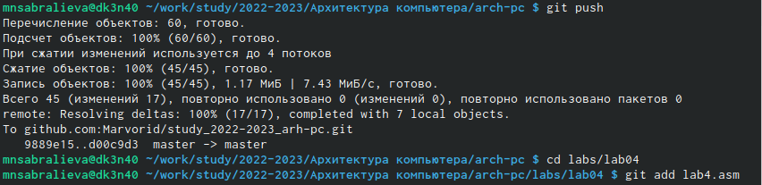

---
## Front matter
title: "Лабораторная работа №4"
subtitle: "Архитектура вычислительных систем"
author: "Сабралиева Марворид Нуралиевна"

## Generic otions
lang: ru-RU
toc-title: "Содержание"

## Bibliography
bibliography: bib/cite.bib
csl: pandoc/csl/gost-r-7-0-5-2008-numeric.csl

## Pdf output format
toc: true # Table of contents
toc-depth: 2
lof: true # List of figures
lot: true # List of tables
fontsize: 12pt
linestretch: 1.5
papersize: a4
documentclass: scrreprt
## I18n polyglossia
polyglossia-lang:
  name: russian
  options:
	- spelling=modern
	- babelshorthands=true
polyglossia-otherlangs:
  name: english
## I18n babel
babel-lang: russian
babel-otherlangs: english
## Fonts
mainfont: PT Serif
romanfont: PT Serif
sansfont: PT Sans
monofont: PT Mono
mainfontoptions: Ligatures=TeX
romanfontoptions: Ligatures=TeX
sansfontoptions: Ligatures=TeX,Scale=MatchLowercase
monofontoptions: Scale=MatchLowercase,Scale=0.9
## Biblatex
biblatex: true
biblio-style: "gost-numeric"
biblatexoptions:
  - parentracker=true
  - backend=biber
  - hyperref=auto
  - language=auto
  - autolang=other*
  - citestyle=gost-numeric
## Pandoc-crossref LaTeX customization
figureTitle: "Рис."
tableTitle: "Таблица"
listingTitle: "Листинг"
lofTitle: "Список иллюстраций"
lotTitle: "Список таблиц"
lolTitle: "Листинги"
## Misc options
indent: true
header-includes:
  - \usepackage{indentfirst}
  - \usepackage{float} # keep figures where there are in the text
  - \floatplacement{figure}{H} # keep figures where there are in the text
---

# Цель работы
Освоение процедуры компиляции и сборки программ, написанных на ассем-
блере NASM.

# Задание
1. В каталоге ~/work/arch-pc/lab05 с помощью команды cp создайте копию
файла hello.asm с именем lab5.asm
2. С помощью любого текстового редактора внесите изменения в текст про-
граммы в файле lab5.asm так, чтобы вместо Hello world! на экран выво-
дилась строка с вашими фамилией и именем.
3. Оттранслируйте полученный текст программы lab5.asm в объектный
файл. Выполните компоновку объектного файла и запустите получивший-
ся исполняемый файл.
4. Скопируйте файлы hello.asm и lab5.asm в Ваш локальный репозиторий
в каталог ~/work/study/2022-2023/"Архитектура компьютера"/arch-
pc/labs/lab05/. Загрузите файлы на Github.
Здесь приводится описание задания в соответствии с рекомендациями
методического пособия и выданным вариантом.

# Выполнение лабораторной работы
1.Создаём каталог для работы с программами на языке ассемблера NASM:  [-@fig:001]

{ #fig:001 width=90% }

2. Переходим в созданный каталог.  [-@fig:002]

{ #fig:002 width=90% }

3. Создаем текстовый файл с именем hello.asm:    [-@fig:003]

{ #fig:003 width=90% }

4. Открываем этот файл с помощью текстового редактора gedit и вводим в него данный нам текст:    [-@fig:004]

{ #fig:004 width=90% }

5. Превращаем текст программы в объективный код. Проверяем с помощью команды ls.  [-@fig:005] 

{ #fig:005 width=90% }

6. Передаем на обработку компоновщику и проверяем:     [-@fig:006]

{ #fig:006 width=90% }

7. Ключ -o с последующим значением задаёт в данном случае имя создаваемого исполняемого файла. [-@fig:007]

{ #fig:007 width=90% }

8. Запустить на выполнение созданный исполняемый файл, находящийся в текущем каталоге, можно с пошью команды, показанной на рисунке [-@fig:008]

{ #fig:008 width=90% }

9. В каталоге ~/work/arch-pc/lab05 с помощью команды cp создадим копию
файла hello.asm с именем lab5.asm:     [-@fig:009]

{ #fig:009 width=90% }

10. С помощью текстового редактора внесём изменения в текст программы в файле lab5.asm так, чтобы вместо Hello world! на экран выводилась строка с фамилией и именем.  [-@fig:010]

{ #fig:010 width=90% }

11. Оттранслируем полученный текст программы lab5.asm в объектный файл. Выполним компоновку объектного файла и запустим получившийся исполняемый файл     [-@fig:011]

{ #fig:011 width=90% }

12. Скопируем файлы hello.asm и lab4.asm в свой локальный репозиторий в каталог ~/work/study/2022-2023/"Архитектура компьютера"/arch-pc/labs/lab04 и загрузим файлы на Github как видно на рисунке [-@fig:012]

{ #fig:012 width=90% }

и на рисунке [-@fig:013]

{ #fig:013 width=90% }

# Выводы

Мы обучились работать, компилировать и собирать программы написанные на ассмблере NASM.

# Список литературы{.unnumbered}

::: {#refs}
:::
