---
## Front matter
title: "Лабораторная работа №5"
subtitle: "Архитектура вычислительных систем"
author: "Сабралиева Марворид Нуралиевна"

## Generic otions
lang: ru-RU
toc-title: "Содержание"

## Bibliography
bibliography: bib/cite.bib
csl: pandoc/csl/gost-r-7-0-5-2008-numeric.csl

## Pdf output format
toc: true # Table of contents
toc-depth: 2
lof: true # List of figures
lot: true # List of tables
fontsize: 12pt
linestretch: 1.5
papersize: a4
documentclass: scrreprt
## I18n polyglossia
polyglossia-lang:
  name: russian
  options:
	- spelling=modern
	- babelshorthands=true
polyglossia-otherlangs:
  name: english
## I18n babel
babel-lang: russian
babel-otherlangs: english
## Fonts
mainfont: PT Serif
romanfont: PT Serif
sansfont: PT Sans
monofont: PT Mono
mainfontoptions: Ligatures=TeX
romanfontoptions: Ligatures=TeX
sansfontoptions: Ligatures=TeX,Scale=MatchLowercase
monofontoptions: Scale=MatchLowercase,Scale=0.9
## Biblatex
biblatex: true
biblio-style: "gost-numeric"
biblatexoptions:
  - parentracker=true
  - backend=biber
  - hyperref=auto
  - language=auto
  - autolang=other*
  - citestyle=gost-numeric
## Pandoc-crossref LaTeX customization
figureTitle: "Рис."
tableTitle: "Таблица"
listingTitle: "Листинг"
lofTitle: "Список иллюстраций"
lotTitle: "Список таблиц"
lolTitle: "Листинги"
## Misc options
indent: true
header-includes:
  - \usepackage{indentfirst}
  - \usepackage{float} # keep figures where there are in the text
  - \floatplacement{figure}{H} # keep figures where there are in the text
---

# Цель работы

Приобретение практических навыков работы в Midnight Commander. Освоение
инструкций языка ассемблера mov и int

# Задание

1. Создайте копию файла lab6-1.asm. Внесите изменения в программу (без
использования внешнего файла in_out.asm), так чтобы она работала по
следующему алгоритму:
• вывести приглашение типа “Введите строку:”;
• ввести строку с клавиатуры;
• вывести введённую строку на экран.
2. Получите исполняемый файл и проверьте его работу. На приглашение
ввести строку введите свою фамилию.
3. Создайте копию файла lab6-2.asm. Исправьте текст программы с исполь-
зование подпрограмм из внешнего файла in_out.asm, так чтобы она ра-
ботала по следующему алгоритму:
• вывести приглашение типа “Введите строку:”;
• ввести строку с клавиатуры;
• вывести введённую строку на экран.
4. Создайте исполняемый файл и проверьте его работу.

# Выполнение лабораторной работы

1. Откроем Midnight Commander: [-@fig:001]

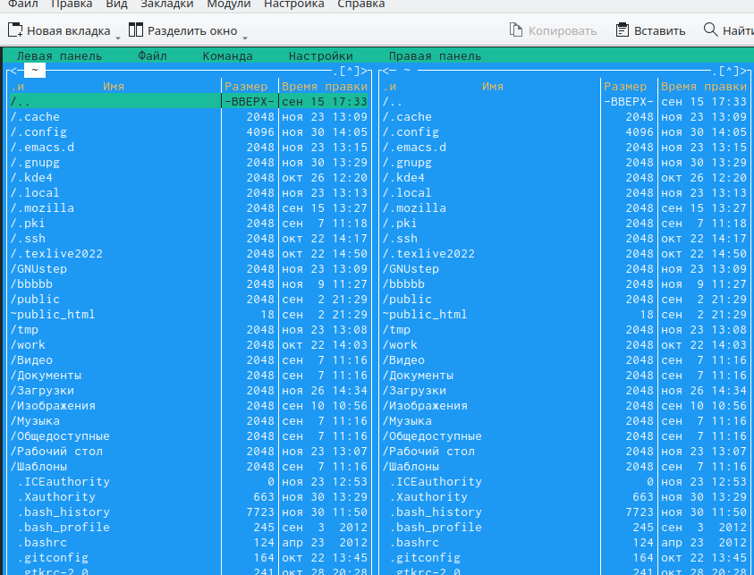{ #fig:001 width=90% }

2. Пользуясь клавишами клавиатуры перейдем в каталог arch-pc [-@fig:002]

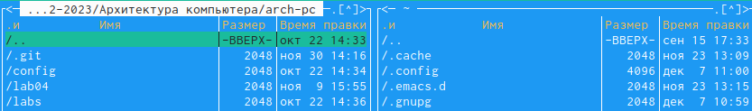{ #fig:002 width=90% }

3. С помощью функциональной клавиши F7 создаeм папку lab05 и переходим в созданный каталог: [-@fig:003]

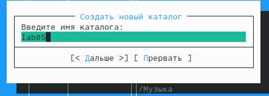{ #fig:003 width=90% }

4. Пользуясь строкой ввода и командой touch создаeм файл lab5.asm [-@fig:004]

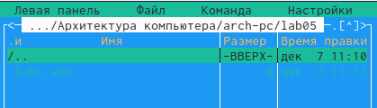{ #fig:004 width=90% }

5. С помощью функциональной клавиши F4 откроем файл lab5.asm для редактирования во встроенном редакторе. В нашем случае это редактор mcedit [-@fig:005]

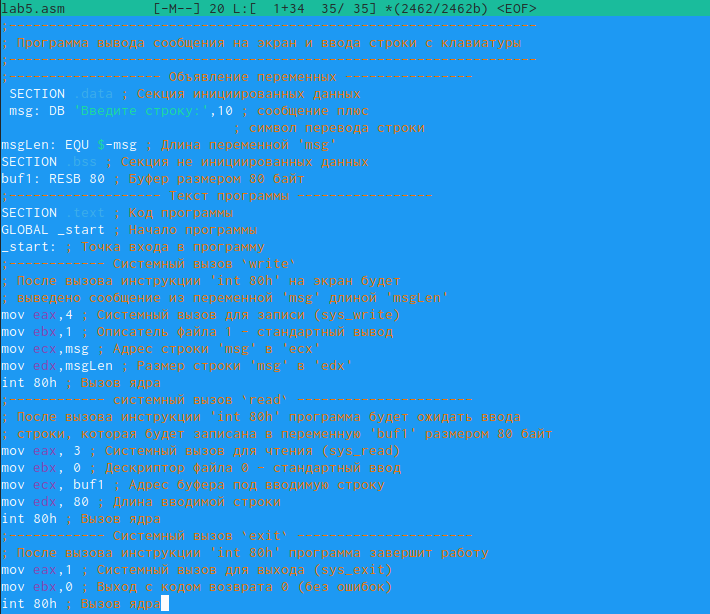{ #fig:005 width=90% }

6. Введем в текст программы, сохраним изменения и проверим результат с помощью клавиши F3 [@fig:006]

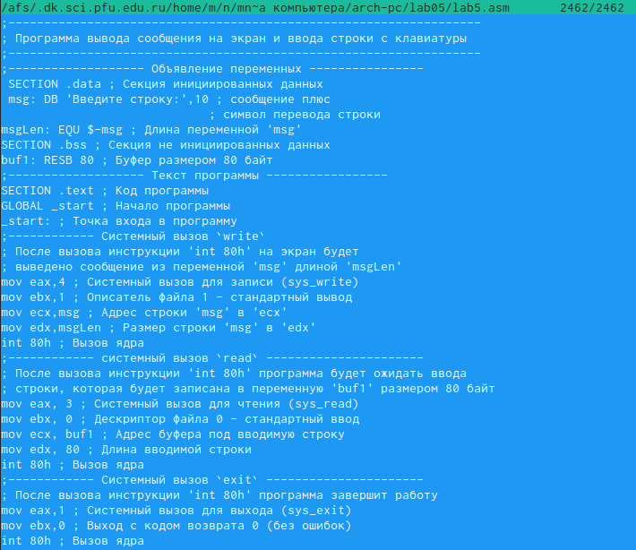{ #fig:006 width=90% }

7. Оттранслируем текст программы lab5.asm в объектный файл.  [-@fig:007]

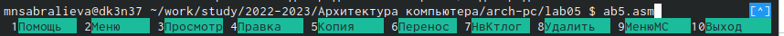{ #fig:007 width=90% }

8. Выполним компоновку объектного файла и запустим получившийся исполняемый файл. Программа выводит строку 'Введите строку:' и ожидает ввода с клавиатуры. На запрос введем свои ФИО [-@fig:008]

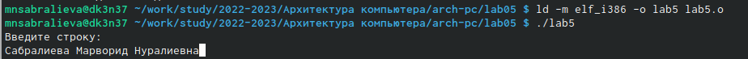{ #fig:008 width=90% }

Проверим полученные файлы [-@fig:009]

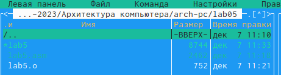{ #fig:009 width=90% }

9. Скачаем файл in_out.asm со страницы курса в ТУИС. [-@fig:010]

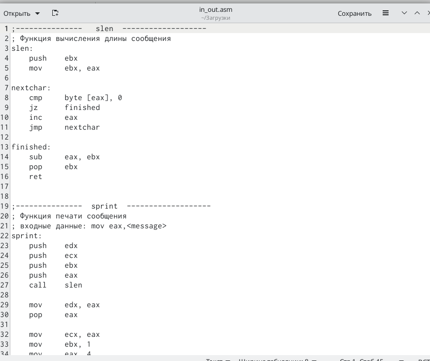{ #fig:010 width=90% }

10. Подключаемый файл in_out.asm должен лежать в том же каталоге, что и файл с программой, в которой он используется. Скопируем файл in_out.asm  в каталог с файлом lab5.asm [-@fig:011]

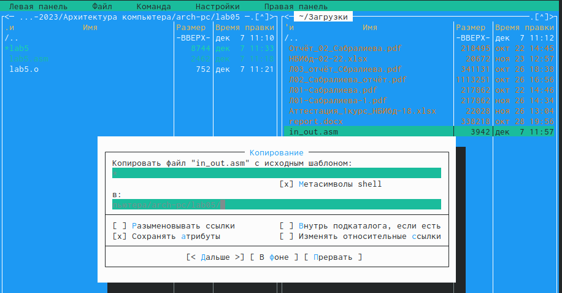{ #fig:011 width=90% }

11. С помощью функциональной клавиши F6 создайте копию файла lab5.asm с именем lab5-2.asm [@fig:012]

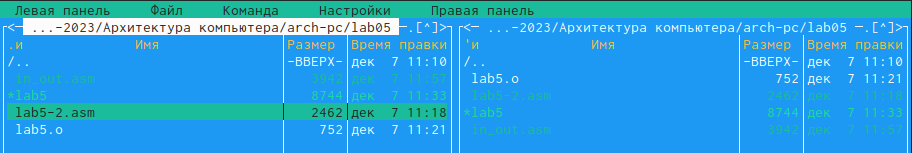{ #fig:012 width=90% }

12. Исправим текст программы в файле lab5-2.asm с использование под-программ из внешнего файла in_out.asm  [@fig:013]

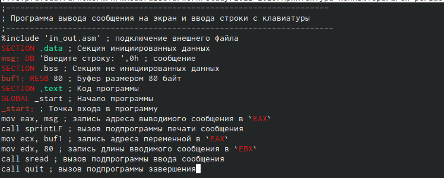{ #fig:013 width=90% }

Создадим исполняемый файл и проверим его работу:  [@fig:014]

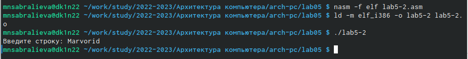{ #fig:014 width=90% }

13. В файле lab6-2.asm заменим подпрограмму sprintLF на sprint. [@fig:015]

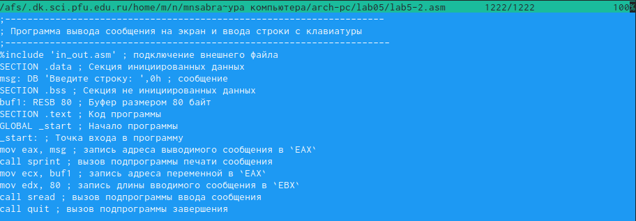{ #fig:015 width=90% }

sprintLF – работает аналогично sprint, но при выводе на экран добавляет к сообщению символ перевода строки.Создадим исполняемый файл и проверим его работу:  [@fig:016]

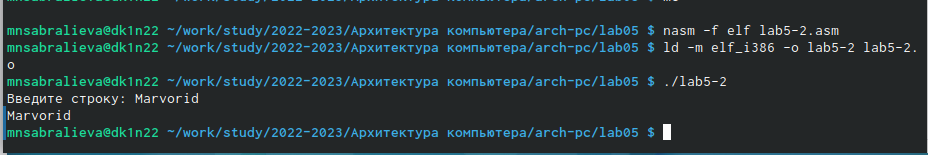{ #fig:016 width=90% }

14. Создадим копию файла lab5.asm.Внесем изменения в программу (без использования внешнего файла in_out.asm)  [@fig:017]

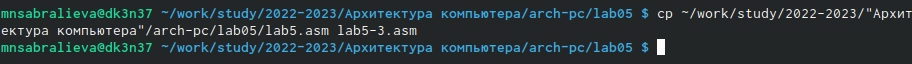{ #fig:017 width=90% }

15. Проверим его работу: [@fig:018]

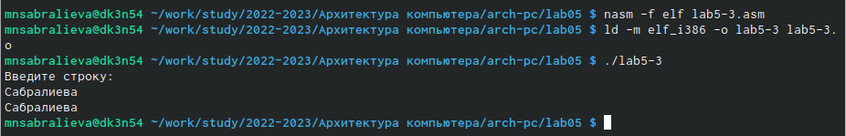{ #fig:018 width=90% }

16. Создадим копию файла lab6-2.asm:  [@fig:019]

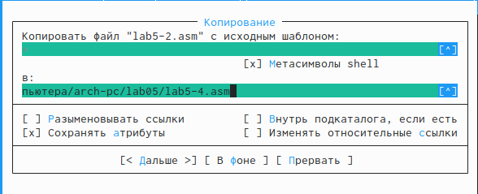{ #fig:019 width=90% }

Исправим текст программы с использованием подпрограмм из внешнего файла in_out.asm:  [@fig:020]

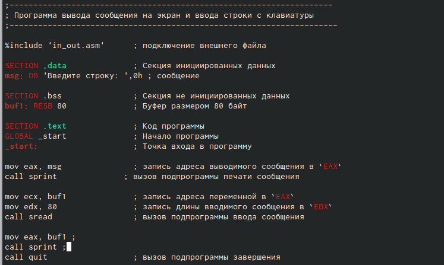{ #fig:020 width=90% }

17. Создадим исполняемый файл и проверим его работу: [@fig:021]

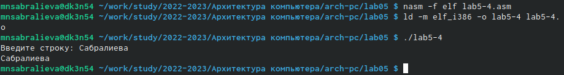{ #fig:021 width=90% }

# Выводы

Мы приобрели практические навыки работы в Midnight Commander и освоили инструкции языка ассемблера mov и int.

# Список литературы{.unnumbered}

::: {#refs}
:::
