---
## Front matter
title: "Лабораторная работа №6"
subtitle: "Архитектура вычислительных систем"
author: "Сабралиева Марворид Нуралиевна"

## Generic otions
lang: ru-RU
toc-title: "Содержание"

## Bibliography
bibliography: bib/cite.bib
csl: pandoc/csl/gost-r-7-0-5-2008-numeric.csl

## Pdf output format
toc: true # Table of contents
toc-depth: 2
lof: true # List of figures
lot: true # List of tables
fontsize: 12pt
linestretch: 1.5
papersize: a4
documentclass: scrreprt
## I18n polyglossia
polyglossia-lang:
  name: russian
  options:
	- spelling=modern
	- babelshorthands=true
polyglossia-otherlangs:
  name: english
## I18n babel
babel-lang: russian
babel-otherlangs: english
## Fonts
mainfont: PT Serif
romanfont: PT Serif
sansfont: PT Sans
monofont: PT Mono
mainfontoptions: Ligatures=TeX
romanfontoptions: Ligatures=TeX
sansfontoptions: Ligatures=TeX,Scale=MatchLowercase
monofontoptions: Scale=MatchLowercase,Scale=0.9
## Biblatex
biblatex: true
biblio-style: "gost-numeric"
biblatexoptions:
  - parentracker=true
  - backend=biber
  - hyperref=auto
  - language=auto
  - autolang=other*
  - citestyle=gost-numeric
## Pandoc-crossref LaTeX customization
figureTitle: "Рис."
tableTitle: "Таблица"
listingTitle: "Листинг"
lofTitle: "Список иллюстраций"
lotTitle: "Список таблиц"
lolTitle: "Листинги"
## Misc options
indent: true
header-includes:
  - \usepackage{indentfirst}
  - \usepackage{float} # keep figures where there are in the text
  - \floatplacement{figure}{H} # keep figures where there are in the text
---

# Цель работы

Освоение арифметических инструкций языка ассемблера NASM.

# Задание

Написать программу вычисления выражения 𝑦 = 𝑓(𝑥). Программа должна
выводить выражение для вычисления, выводить запрос на ввод значения
𝑥, вычислять заданное выражение в зависимости от введенного 𝑥, выво-
дить результат вычислений. Вид функции 𝑓(𝑥) выбрать из таблицы 6.3
вариантов заданий в соответствии с номером полученным при выполне-
нии лабораторной работы. Создайте исполняемый файл и проверьте его
работу для значений 𝑥1 и 𝑥2 

# Выполнение лабораторной работы

1. Создадим каталог для программ лабораторной работы №6, перейдем в него и создадим файл lab6-1.asm: [-@fig:001]

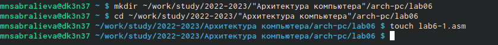{ #fig:001 width=90% }

2. Рассмотрим примеры программ вывода символьных и численных значений. Программы будут выводить значения записанные в регистр eax.Введем в файл lab6-1.asm текст программы из листинга [-@fig:002]

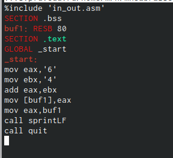{ #fig:002 width=90% }

Создадим исполняемый файл и запустим его [-@fig:003]

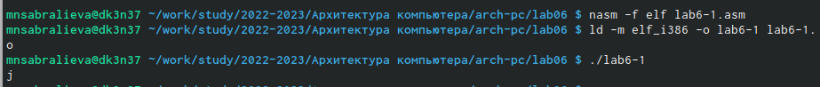{ #fig:003 width=90% }

3. Изменяем текст программы, заменяем две строки: [-@fig:004]

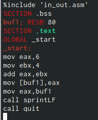{ #fig:004 width=90% }

Создадим исполняемый файл и запустим его [-@fig:005]

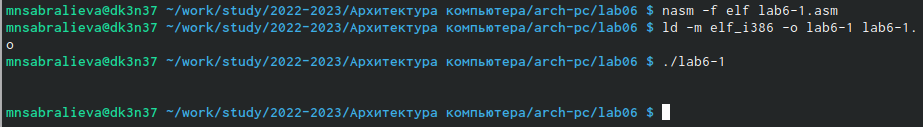{ #fig:005 width=90% }

Полученный символ не отображается при выводе на экран

4. Создадим файл lab6-2.asm в каталоге ~/work/arch-pc/lab06 и введем в него текст программы из листинга. Созадим исполняемый файл и запустим его [-@fig:006]

{ #fig:006 width=90% }

5. Аналогично предыдущему примеру изменим символы на числа. Заменим строки и printLF на iprint [-@fig:007]

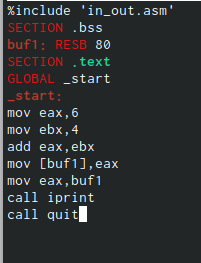{ #fig:007 width=90% }

Команда iprint выводит на экран цифру в системе ASCII. Команда iprintLF работает аналогично, но добавляет символ превода строки.

6. Создайте файл lab6-3.asm в каталоге ~/work/arch-pc/lab06: [-@fig:008]

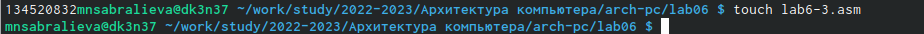{ #fig:008 width=90% }

Записываем в этот файл текст программы. Создаем исполняем файл и выводим его [-@fig:009]

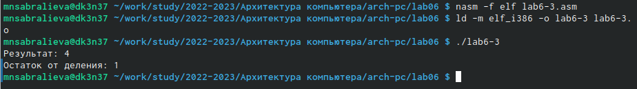{ #fig:009 width=90% }

Измените текст программы для вычисления выражения 𝑓(𝑥) = (4 ∗ 6 + 2)/5. [-@fig:010]

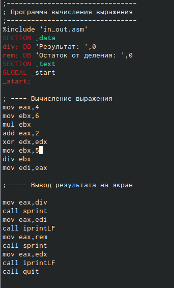{ #fig:010 width=90% }

Создайте исполняемый файл и проверьте его работу [-@fig:011]

{ #fig:011 width=90% }

7. Создайте файл variant.asm в каталоге ~/work/arch-pc/lab06 [-@fig:012]

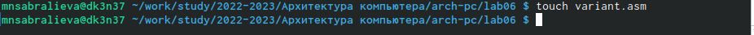{ #fig:012 width=90% }

Вводим текст, создаем исполняемый файл и запускаем его [-@fig:013]

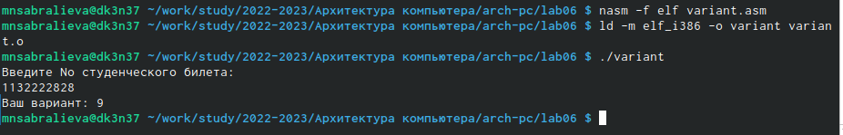{ #fig:013 width=90% }

1.В программе variant строки 

mov eax, rem
call sprint

отвечают за вывод в консоль надписи "Ваш вариант.".

2.Строки 
mov ecx, x
mov edx, 80
call sread
отвечают за ввод значения переменной х.

3.Инструкция call atoi преобразует значение регистра eax из кода ASCII в число.

4.Непосредственно номер варианта выисляют следующие строки:
 mov ebx, 20
 div ebx
 inc edx

5.Остаток от целочисленного деления помещается в регистр edx 

6.Команда inc edx увеличивает на еденицу значение в соответствующем регистре

7.За вывод на экран результата вычислений отвечают строки 
mov eax, edx
call iprintLF

8. Напишем программу для вычисления выражения f(x)=10 + (31𝑥 − 5) [-@fig:013]

{ #fig:013 width=90% }

# Выводы

Мы освоили арифметические инструкции языка ассемблера NASM.

# Список литературы{.unnumbered}

::: {#refs}
:::
